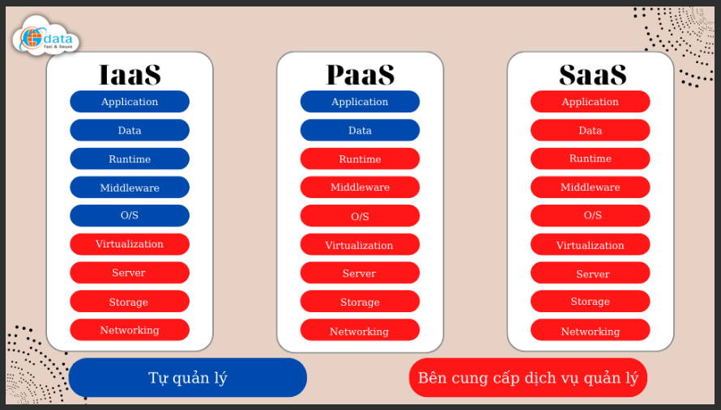
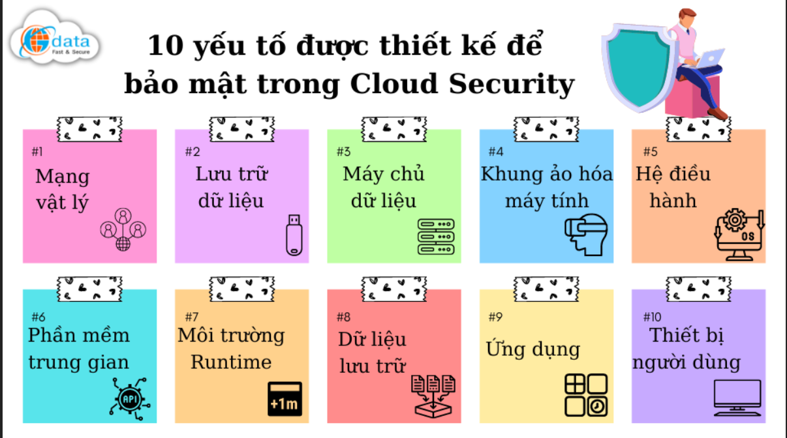

- Group 5:

* Mai Thanh Duy 20227225
* Tran Duc Toan 20195929
* Vu Van Nghia 20206205

- Topic: Cloud security
- Title: Cloud security- What is it?

- Source:
<!-- https://zero.sci-hub.se/4802/3203ff270e355ae877a2f92d2c3956f1/sirohi2015.pdf -->
<!-- https://sci-hub.ru/10.1109/TIFS.2013.2286456 -->
<!-- https://sci-hub.se/downloads/2021-06-12/b3/ermakova2020.pdf -->
<!-- https://sci-hub.se/downloads/2020-05-30/aa/zeng2019.pdf -->

<!-- What is cloud security? -->
<!-- Bảo mật đám mây là tập hợp các quy trình và công nghệ được thiết kế để giải quyết các mối đe dọa bên ngoài và bên trong đối với bảo mật doanh nghiệp. -->
<!-- Cloud security is a collection of procedures and technology designed to address external and internal threats to business security.  -->

<!-- Điện toán đám mây là gì? -->
<!-- What is cloud computing? -->
<!-- "Đám mây" hay cụ thể hơn là "điện toán đám mây" đề cập đến quá trình truy cập các tài nguyên, phần mềm và cơ sở dữ liệu qua internet và bên ngoài giới hạn của các hạn chế về phần cứng cục bộ. Công nghệ này mang lại cho các tổ chức sự linh hoạt khi mở rộng quy mô hoạt động bằng cách giảm tải một phần hoặc phần lớn công việc quản lý cơ sở hạ tầng cho các nhà cung cấp dịch vụ lưu trữ bên thứ ba. -->
<!-- The "cloud" or, more specifically, "cloud computing" refers to the process of accessing resources, software and databases over the internet and outside the confines of local hardware restrictions. This technology gives organizations flexibility when scaling their operations by offloading a portion, or majority, of their infrastructure management to third-party hosting providers. -->

<!-- Các dịch vụ điện toán đám mây phổ biến và được áp dụng rộng rãi nhất là: -->
<!-- The most common and widely adopted cloud computing services are: -->
<!-- IaaS (Infrastructure-as-a-Service):  -->

Offers a hybrid approach, which allows organizations to manage some of their data and applications on-premises. At the same time, it relies on cloud providers to manage servers, hardware, networking, virtualization and storage needs.

<!-- PaaS (Platform-as-a-Service):  -->

Gives organizations the ability to streamline their application development and delivery. It does so by providing a custom application framework that automatically manages operating systems, software updates, storage and supporting infrastructure in the cloud.

<!-- SaaS (Software-as-a-Service):  -->

Provides cloud-based software hosted online and typically available on a subscription basis. Third-party providers manage all potential technical issues, such as data, middleware, servers and storage. This setup helps minimize IT resource expenditures and streamline maintenance and support functions.

 <!-- Bảo mật điện toán đám mây là bảo mật những gì? -->

Bảo mật điện toán đám mây như đã nói ở trên là bảo vệ môi trường Cloud Computing của các doanh nghiệp. Chi tiết hơn, toàn bộ phạm vi của Cloud Security được thiết kế để bảo mật các bộ phận sau:

Mạng vật lý (Physical Networks): Bộ định tuyến, nguồn điện, hệ thống cáp, bảng điều khiển, …
Lưu trữ dữ liệu (Data Storage): ổ cứng, bộ nhớ lưu trữ, …
Máy chủ dữ liệu (Data Servers): phần cứng và phần mềm tính toán mạng lõi
Khung ảo hóa máy tính (Computer Virtualization Frameworks): phần mềm máy ảo, máy chủ và máy khách tham gia sử dụng dịch vụ Cloud Computing
Hệ điều hành (OS – Operating System): các phần mềm chứa dịch vụ
Phần mềm trung gian (Middleware): giúp quản lý giao diện lập trình ứng dụng (API)
RTE (Môi trường runtime): là môi trường thực thi và duy trì một chương trình đang chạy
Dữ liệu lưu trữ: là tất cả các thông tin được lưu trữ, chỉnh sửa và truy cập vào
Ứng dụng (Applications): có thể là các phần mềm truyền thống như (email, phần mềm tính thuế, bộ năng suất, …)
Các thiết bị người dùng cuối (End-user hardware): gồm máy tính, điện thoại, các thiết bị thuộc IoT, …
Với điện toán đám mây, tính sở hữu của các thành phần trên có thể rất khác nhau, khiến cho phạm vi trách nhiệm bảo mật của các máy chủ đặt tại vị trí khách hàng thiếu minh bạch. Vì lẽ đó, bảo mật đám mây có thể sẽ khác nhau ở tùy từng vị trí và tùy vào quyền của mỗi người với từng nhóm thành phần, điều quan trọng là phải hiểu các chúng cùng hoạt động như thế nào.

